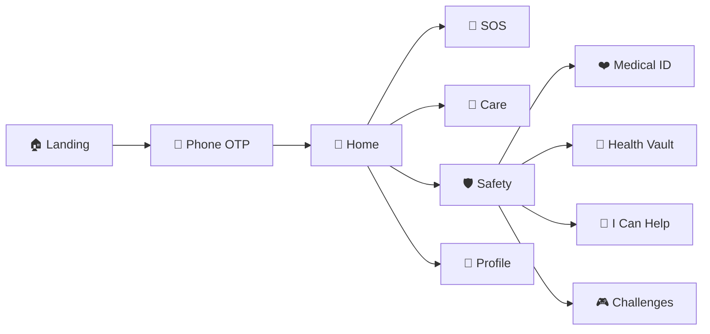

<div align="center">

# 🛡️ Arogya Raksha · ResQMed

### *Emergency ho ya check-up — sab ek hi app mein.* 🇮🇳

**Uber-style emergency help** · **Hospital booking** · **Health vault** · **Safety toolkit**

<br />

[](https://your-firebase-hosting-url.web.app)
[]()
[]()

<br />


<br />

*English · हिन्दी · తెలుగు*

</div>

---

<br />

## 🎬 Live Prototype & Demo

> 👇 **Yahan apna live link aur screenshots add karo** — mentors & judges ke liye sabse pehle yahi dikhega!

<div align="center">

### 🔗 Live App Link : https://res-q-med-hospital-emergency.vercel.app

<br />

### 📱 App Screenshots

<!-- 
  📌 HOW TO ADD:
  1. Create folder: docs/screenshots/
  2. Add images: home.png, sos.png, care.png, safety.png
  3. Uncomment the lines below
-->

<!--
| 🏠 Home | 🚨 SOS | 🏥 Care | 🛡️ Safety |
|:---:|:---:|:---:|:---:|
|  |  |  |  |
-->

| 🏠 Home | 🚨 SOS | 🏥 Care | 🛡️ Safety |
|:---:|:---:|:---:|:---:|
| image.png | *screenshot yahan | *screenshot yahan* | *screenshot yahan* |
| Dashboard · SOS card · Shortcuts | Live timeline · Helpers | Departments · Booking | Medical ID · Vault · Help |

<br />

### 🎥 Demo Video / GIF *(optional)*

<!--

-->

> 🎬 *Screen recording ya GIF yahan embed karo — `docs/demo.gif` upload karke comment hata do*

</div>

---

<br />

## 💡 Problem → Solution

<table>
<tr>
<td width="50%" valign="top">

### 😰 The Problem
- Emergencies mein **help late** milti hai  
- Hospital booking **alag apps** mein  
- Medical records **kho jaate** hain  
- Safety info **phone unlock** ke bina nahi milti  

</td>
<td width="50%" valign="top">

### ✨ Our Solution
- **One-tap SOS** → nearby helpers + ambulance flow  
- **Care tab** → doctor book karo 1 minute mein  
- **Health Vault** → prescriptions safe rahein  
- **Medical ID** → responders turant dekhein  

</td>
</tr>
</table>

---

<br />

## ✨ Features — Detail Mein

<div align="center">

### 🗺️ App Flow



**Bottom Navigation:**  
🏠 Home · 🩺 Care · **🚨 SOS** *(center FAB)* · 🛡️ Safety · 👤 Profile

</div>

<br />

### 🚨 Emergency SOS

| | |
|---|---|
| 🔴 | **One-tap SOS** — Big red button, instant trigger |
| 🎙️ | **Voice SOS** — Bol ke help maango *(EN / HI / TE)* |
| ⚠️ | **Crash mode** — Accident report + auto-alert |
| 📍 | **Live location** — Share & track on map |
| ⏱️ | **Live incident timeline** — Trigger → Helpers → Ambulance → Hospital |
| 💬 | **In-app chat** — Victim ↔ Helper real-time |
| 🏥 | **Hospital alerts** — ER prep notification |
| ⛑️ | **Smart helmet sync** — Crash detection from Aarogya Helmet One |

<br />

### 🤝 Helper Network *(Rapido-style)*

| | |
|---|---|
| 📡 | **Nearby SOS feed** — Live emergencies around you |
| ✅ | **Accept & navigate** — ETA, distance, live map |
| 🏆 | **Leaderboard** — Top helpers & Arogya Points |
| 🚗 | **Trip history** — Helmet rides + help history |
| 🔔 | **Popup overlay** — Incoming SOS alert even in-app |

<br />

### 🏥 Hospital & Care

| | |
|---|---|
| 🩺 | **12+ departments** — Cardiology, Ortho, Dental, Pediatrics… |
| 🗺️ | **Google Maps hospitals** — Nearby options live |
| 🏨 | **Partner hospital** — Arogya Medicare · 24×7 booking |
| 📅 | **Slot booking** — Dept → Hospital → Doctor → Confirm |
| 🔔 | **Upcoming appointments** — Reminder on home screen |
| 📁 | **Auto vault save** — Consultation records stored |

<br />

### 🛡️ Safety Toolkit

| | |
|---|---|
| ❤️ | **Medical ID** — Blood group, allergies, meds · "Show Big" for paramedics |
| 👥 | **Safety Circle** — Emergency contacts · WhatsApp/SMS cascade on SOS |
| 📁 | **Health Vault** — Prescriptions, lab reports, X-rays upload |
| 📞 | **Emergency helplines** — 112 · 108 · 100 · 1091 one-tap dial |
| 🎮 | **Health challenges** — Quizzes & real-life scenarios |
| 📊 | **Readiness score** — Profile + contacts + challenges = /100 |

<br />

### 🎮 Gamification & Learning

| | |
|---|---|
| 🏅 | **Arogya Points** — Earn for helping, learning, completing profile |
| 🎯 | **Health Day events** — Themed quizzes *(World Heart Day, etc.)* |
| 🧠 | **Scenario challenges** — "What would you do?" first-aid situations |
| 📈 | **Tier badges** — Rookie → Protector → Guardian → Hero |
| 🏆 | **Community leaderboard** — Top guardians in your city |

<br />

### 📊 Analytics Dashboard

| | |
|---|---|
| 📉 | **SOS trends** — Volume, severity, response times |
| ⏱️ | **Avg. response metrics** — Helper accept · Ambulance · Hospital |
| 🗺️ | **Hotspot map** — High-incident areas |
| 👥 | **Guardian stats** — Community impact numbers |

<br />

### 🌐 Multilingual — Poora App

| Language | Script | Coverage |
|----------|--------|----------|
| 🇬🇧 English | Latin | Full UI + voice SOS |
| 🇮🇳 Hindi | हिन्दी | Dashboard, SOS timeline, departments, challenges |
| 🇮🇳 Telugu | తెలుగు | Dashboard, SOS timeline, departments, challenges |

<br />

### ⛑️ Smart Helmet Integration

| | |
|---|---|
| 🔗 | **Pair helmet** — BLE / QR demo pairing |
| 🔋 | **Live status** — Battery, connection, sensor health |
| 💥 | **Crash detection** — Auto SOS trigger |
| 🛣️ | **Ride history** — Daily km & trip log |

---

<br />

## 🏗️ Tech Stack

<div align="center">

| Layer | Tools |
|-------|-------|
| ⚛️ **Frontend** | React 19 · TypeScript · Vite 8 · Tailwind CSS · Framer Motion |
| 🧭 **Routing** | React Router — Hash mode *(static hosting friendly)* |
| 🔥 **Backend** | Firebase Auth · Firestore · Storage · Cloud Functions |
| 🗺️ **Maps** | Google Maps JavaScript API |
| 🌐 **i18n** | i18next · react-i18next |
| 📱 **Mobile-ready** | Capacitor *(Android / iOS scaffold)* |

</div>

---

<br />

## 🚀 Quick Start

```bash
# 1️⃣ Clone
git clone https://github.com/aakriti1613/ResQMed-Hospital-Emergency.git
cd ResQMed-Hospital-Emergency

# 2️⃣ Install
npm install

# 3️⃣ Environment
cp .env.example .env
# ✏️ Fill VITE_FIREBASE_* and VITE_GOOGLE_MAPS_API_KEY

# 4️⃣ Run 🎉
npm run dev
```

🌐 Open **http://localhost:5173/**  
Routes: `/#/` · `/#/login` · `/#/app`

<details>
<summary>🧪 <b>Demo mode</b> — Firebase ke bina bhi chalega!</summary>

<br />

`.env` mein Firebase keys **mat** daalo → app **demo mode** mein khulega:
- ✅ Koi bhi 6-digit OTP accept  
- ✅ UI poora explore kar sakte ho  
- ⚠️ Production ke liye Firebase setup zaroori hai  

</details>

---

<br />

## 🔐 Environment Variables

| Variable | Required | Kya karta hai |
|----------|:--------:|---------------|
| `VITE_FIREBASE_*` | ✅ Prod | Auth · Firestore · Storage |
| `VITE_GOOGLE_MAPS_API_KEY` | ⭐ Recommended | Hospital maps |
| `VITE_FIREBASE_VAPID_KEY` | Optional | Push notifications |
| `VITE_FUNCTIONS_ORIGIN` | Optional | Cloud Functions / emulator |

> ⚠️ `.env` kabhi commit mat karo — sirf `.env.example` commit karo.

---

<br />

## 📦 NPM Scripts

| Command | Kya hota hai |
|---------|--------------|
| `npm run dev` | 🔧 Dev server start |
| `npm run build` | 🏗️ Typecheck + `dist/` build |
| `npm run preview` | 👀 Production preview locally |
| `npm run deploy:hosting` | 🚀 Firebase Hosting deploy |
| `npm run deploy:rules` | 🔒 Firestore + Storage rules |
| `npm run deploy` | 🌍 Full deploy (hosting + functions + rules) |

<details>
<summary>☁️ <b>Firebase deploy checklist</b></summary>

<br />

1. ✅ **Authentication** → Phone OTP enabled  
2. ✅ **Authorized domains** → Hosting domain add karo  
3. ✅ `npm run deploy:rules` → Security rules deploy  
4. ✅ Google Cloud → Maps API key domain-restrict karo  

</details>

---

<br />

## 📂 Project Structure

```
📦 ResQMed-Hospital-Emergency
├── 📁 public/              Icons · PWA manifest · FCM service worker
├── 📁 src/
│   ├── 📁 screens/         Landing · Login · App pages · Admin · Portals
│   ├── 📁 components/      Maps · Timeline · Readiness card · Language switcher
│   ├── 📁 data/            SOS · Users · Hospitals · Points · Challenges
│   ├── 📁 locales/         🇬🇧 en.json · 🇮🇳 hi.json · 🇮🇳 te.json
│   ├── 📁 shell/           AppShell · Bottom nav · Global SOS watcher
│   └── 📄 router.tsx       Hash routes
├── 📁 functions/src/       ☁️ Cloud Functions
├── 📄 firebase.json        Firebase config
├── 📄 firestore.rules      🔒 Database security
└── 📄 .env.example         Environment template
```

---

<br />

## 🗺️ Key Routes

| Route | Screen | Emoji |
|-------|--------|-------|
| `/#/` | Landing page | 🏠 |
| `/#/login` | Phone OTP login | 📱 |
| `/#/app` | Home dashboard | 🏡 |
| `/#/app/sos` | Emergency SOS | 🚨 |
| `/#/app/care` | Hospital & departments | 🏥 |
| `/#/app/safety` | Safety hub | 🛡️ |
| `/#/app/help` | Helper dashboard | 🤝 |
| `/#/app/challenges` | Health day quizzes | 🎮 |
| `/#/app/analytics` | Emergency analytics | 📊 |
| `/#/app/profile` | Profile & settings | 👤 |

---

<br />

## ⚠️ Important Disclaimer

<div align="center">

### 🆘 Asli emergency mein pehle official numbers call karo

# **112** · **108** · **100**

*Yeh app official emergency services ko replace nahi karti — unke saath kaam karti hai.*

</div>

---

<br />

<div align="center">

### 💚 Built with care for safer roads & healthier communities

**Arogya Raksha · ResQMed**  
*Private / Academic Project*

<br />

⭐ *Repo pasand aaye toh star dena mat bhoolna!* ⭐

</div>
